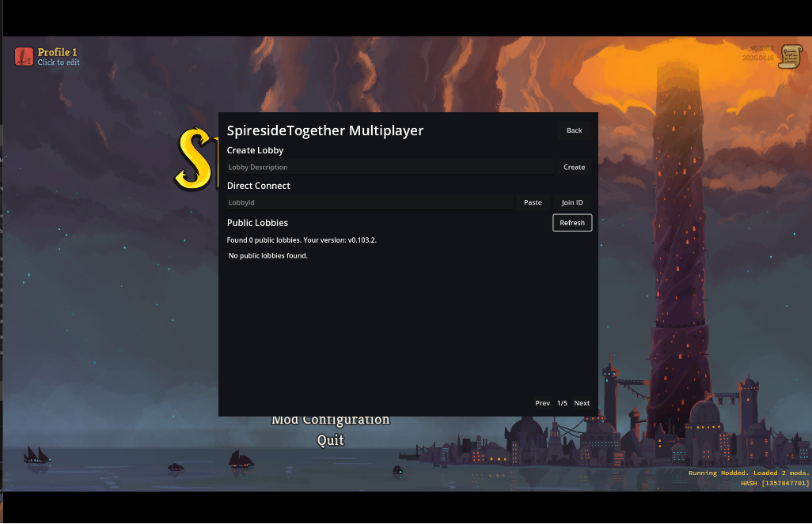

# Spireside Together

Spireside Together is a Slay the Spire 2 mod that enables public multiplayer with strangers by enabling hosts to create public lobbies and guests to search with a server browser.

**NOTE: Public lobbies can only be created and discovered by those with this mod or similaar**

For installation instructions, please scroll down to the installation instructions below! Kindly report any issues or post discussion [here](https://github.com/omgyukiel/spireside-together/issues). 

## Features


This mod adds a server browser that can search up to 100 public lobbies with filtering by hostname, description, or game version.

Hosts can create public lobbies from the Spireside Together Multiplayer menu and copy their lobby ids.

Guests can join directly by lobby ids or connect to lobbies found in the server browser.

**Known Issue: Currently there is no support for reconnects when a player disconnects. This may unfortunately hang the game.**

## Dependencies
This mod inherits from BaseLib and depends on lemonSpire2 for chat support:
- [BaseLib-StS2](https://github.com/Alchyr/BaseLib-StS2/releases/tag/v3.1.4) == v3.1.4
- [lemonSpire2](https://github.com/freude916/lemonSpire2/releases/tag/v0.7.4) == v0.7.4
- Slay the Spire 2 >= v0.105.0 (Currently on beta branch) 

## Compatability
You cannot join lobbies with conflicting base game versions.

**To reduce the risk of error, you must use the exact mod versions listed and follow the exact install steps to guarantee compatibility. Mismatched mods and mod versions can cause the game to hang on black screens.**

It may be possible that truly client-side only mods could work but this behavior is untested.

## Installation


### 0. Review the compatability section and backup your mods
To gaurantee compatability, players must use the same mods and mod versions. Difference in mod versions that result in gameplay changes will causes the game to hang on a black screen when connecting.

**If you already have mods, I suggest backing them up somewhere for public multiplayer.**

### 1. Download dependencies
This mod uses lemonSpire2 for chat, and inherits from BaseLib. Install the EXACT versions listed

1. **Ensure you are running the beta branch of STS2.** Currently this depends on STS2 v0.105.0 or greater.
2. Download lemonSpire2 and BaseLib zip files from github (reccomended) or nexusmods. Do NOT download RitsuLib.
2. Extract the zip folders into the mods folder at your STS2 install location: `*\steamapps\common\Slay the Spire 2\mods`
   3. You can find your install folder by right clicking STS2 in your Steam library, clicking properties, then click "Browse" in "Installed Files."
   4. Create the "mods" folder if it does not exist yet

#### Download Links:
- **BaseLib-StS2 v3.1.4** [github](https://github.com/Alchyr/BaseLib-StS2/releases/tag/v3.1.4) [nexusmods](https://www.nexusmods.com/slaythespire2/mods/103?tab=description)
- **lemonSpire2 v0.7.4** [github](https://github.com/freude916/lemonSpire2/releases/tag/v0.7.4)
[nexusmods](https://www.nexusmods.com/slaythespire2/mods/29?tab=description)

### 2. Remove RitsuLib from lemonSpire2
We will remove RitsuLib to reduce the chance that players have different mod versions. LemonSpire2 v0.7.4 loosely depends on RitsuLib and removing it will remove the mod config feature.

1. Delete RitsuLib from the mods folder if you downloaded it already
2. Open the `lemonSpire2.json` in your `mods/lemonSpire2`

Remove RitsuLib from dependenciess and save the file. `lemonSpire2.json` should look like this:
```json
{
  "id": "lemonSpire2",
  "name": "Lemon Spire 2",
  "author": "freude916",
  "description": "A collection of multiplayer QoL: Chat, State, Damage Tracker",
  "version": "v0.7.4",
  "has_pck": true,
  "has_dll": true,
  "dependencies": [],
  "affects_gameplay": true,
  "min_game_version": "0.105.0"
}
```
### 3. Download spireside-together
1. Download the zip folder in the [latest release](https://github.com/omgyukiel/spireside-together/releases)
2. Extract the zip folder to your mods folder in your `*\steamapps\common\Slay the Spire 2\mods`
3. Launch the game and you should see a new menu option!
      4. If this is your first time using mods your game may shutdown on the first launch

In the bottom right corner you should see your mod hash. If you did all the steps correctly your hash should hae the value `2108211188`.
### 3. (Optional) Sync vanilla saves with modded saves
If this is your first time using mods you may think you have corrupted your saves files, but STS2 just points to a different folder for modded play throughs!

You can find mods to sync vanilla gamess like [this](https://www.nexusmods.com/slaythespire2/mods/372) or manually copy your vanilla saves to your modded by doing the following:
1. Open STS2
2. Open the console by pressing the `~` key
3. Type `open saves` and press enter
4. You should see a folder like `C:\...\SlayTheSpire2\steam\{your_id}\modded\profile1\saves`
5. Go up a few paths until you're out of the "modded" folder. You should see three profiles, copy your desired profile into the modded folder to replace the existing one. 

---
## Contributing Requirements

- Slay the Spire 2 installed through Steam.

- .NET SDK compatible with the project target framework.
- Visual Studio, Rider, or another C# editor.

## Development

Create local machine build settings first:

```bash
cp Directory.Build.props.example Directory.Build.props
```

Then edit `Directory.Build.props` for your local paths. `GodotPath` is required for `dotnet publish` because publishing exports the scene assets into `SpiresideTogether.pck`.

Restore and build the project with:

```bash
dotnet restore
dotnet build
```

If Slay the Spire 2 is not installed at the default path, pass the install path explicitly:

```bash
dotnet build /p:Sts2Path="/path/to/Slay the Spire 2"
```

The template build copies the compiled mod DLL and manifest into the game's `mods/SpiresideTogether/` folder when the game path is configured correctly.

To package Godot scene assets into the mod folder, run:

```bash
dotnet publish
```

---
## License

See [LICENSE](LICENSE).

## Disclaimer

This is an experimental mod for an Early Access game. Game updates may break compatibility, and multiplayer behavior may change as Slay the Spire 2 evolves.
